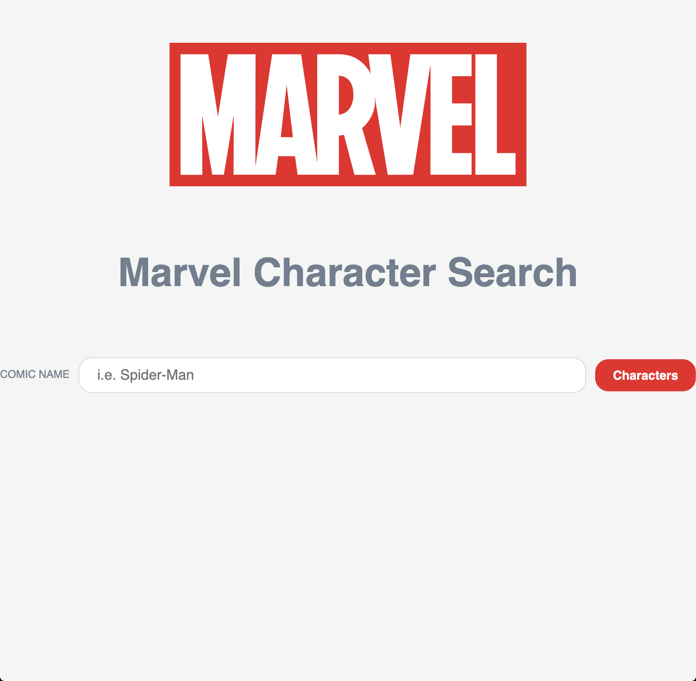
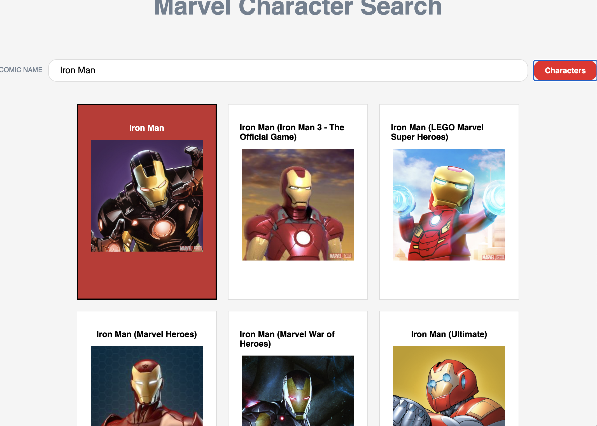

# 🦸‍ Marvel Character Search 🦸‍

Marvel Character Search is a frontend web application that draws its data from the free-to-use Marvel REST API to display characters and was put together with React.js framework. Users can use the search bar to find their favourite characters in the Marvel Universe, as well as variations of said character. 

**Technologies used -**
HTML, CSS, JavaScript / React.js

**URL -**
https://kimwoodfield.github.io/marvelapp-character-search/

**Screenshots -**

